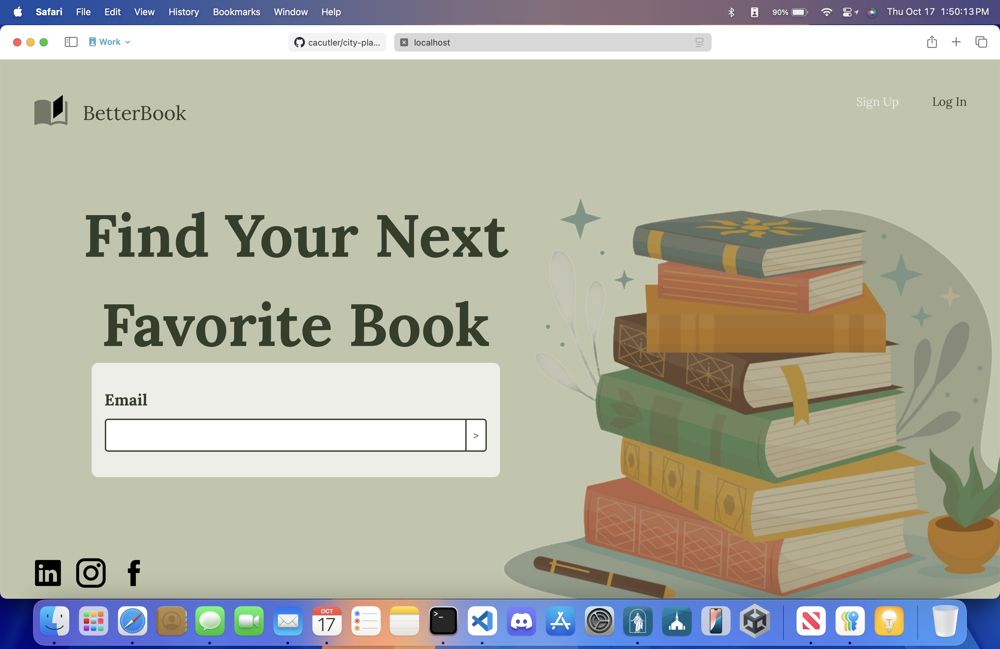
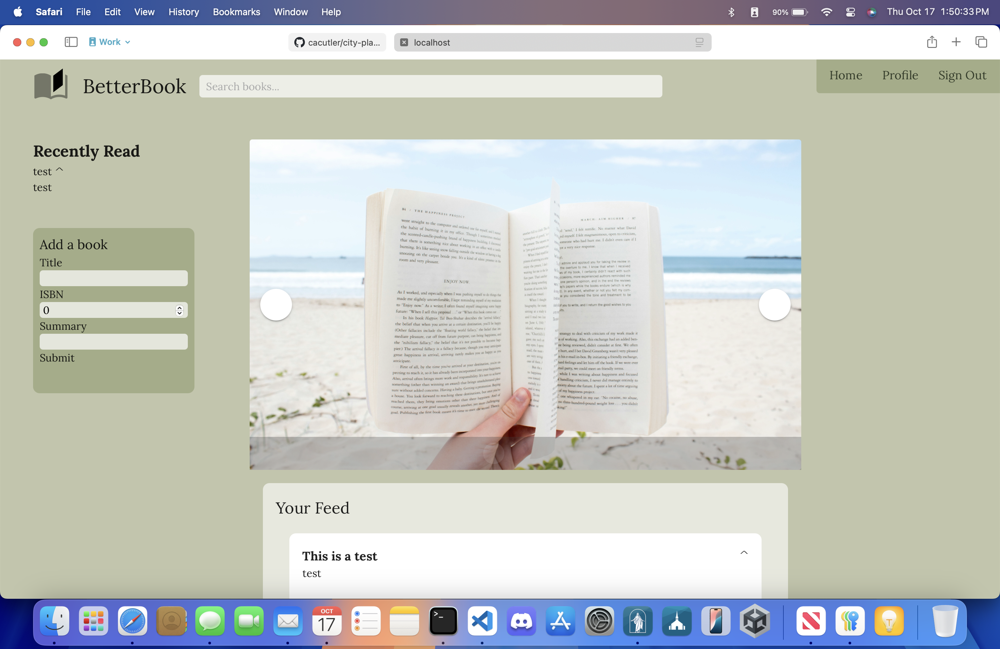

# BetterBook

This is a Code School project developed by Anika Blake and Alex Cutler.  It is designed to be a custom book tracker and book social media site that is better than Goodreads.  The backend uses Express.js built on Node.js that is connected to a MongoDB database to store data.  The frontend uses Vue.js for interactivity with HTML and Vuetify for styling.  

